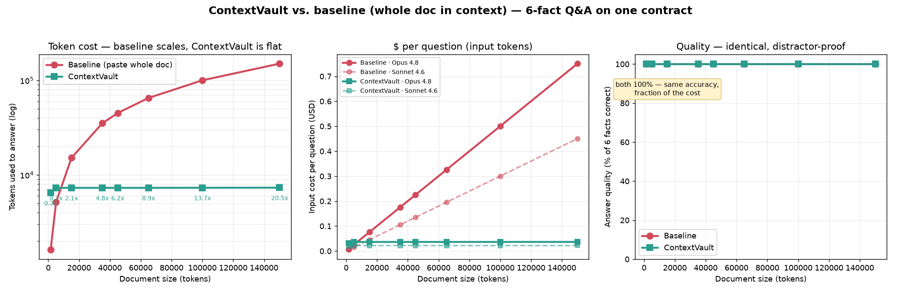

# SaveContext benchmark suite

Measures, across eight document sizes (≈1.5k → 150k tokens), the cost of answering
the **same six fact questions** about one contract — **baseline** (paste the whole
document into the model's context) vs **SaveContext** (compact ingest + task brief
+ targeted expands). Each document embeds the six ground-truth facts with nearby
**distractor** values, so answering correctly requires finding the right clause.

## Headline result



- **Quality: 100% in every cell.** Sixteen real agents (baseline vs SaveContext
  × 8 sizes) each answered 6/6 correctly and rejected every distractor.
- **Tokens: SaveContext is flat (~7.3k), baseline scales with the document.**
  **6.2× at 45k, 13.7× at 100k, 20.5× at 150k** — and the gap keeps widening.
- **Cost (input tokens, per question):** baseline rises to **$0.75 (Opus 4.8)** /
  **$0.45 (Sonnet 4.6)** at 150k; SaveContext stays at **$0.037 / $0.022**.
- **Crossover ≈ 5k tokens:** below it, just paste the doc; above it, SaveContext
  wins and keeps winning.

See [`results.md`](results.md) for the full table and [`results.json`](results.json)
for the raw numbers (including the per-agent token totals, which confirm the trend:
SaveContext agents stayed ~14–19k total regardless of size; baseline agents grew
14k → 71k).

## Reproduce

```bash
cd examples/benchmark_suite
python generate_docs.py  /tmp/bench      # 5 contracts + ground_truth.json
python measure.py        /tmp/bench      # deterministic tokens + $ -> results.json/.md
python plot.py           /tmp/bench      # benchmark.png
```

Quality is measured by running agents against each document (baseline: read the
whole file; SaveContext: CLI only) and grading their answers against
`ground_truth.json`. The committed `results.json` has those quality numbers
filled in (100% across the board).

## Method & honest caveats

- **"Tokens used" = the context the model must read to answer.** Baseline =
  document + questions. SaveContext = the workflow payloads (compact ingest
  response + one task brief + one targeted expand per fact). This isolates
  compression from agent reasoning overhead.
- **Pricing** uses published **input** rates (Opus 4.8 $5/1M, Sonnet 4.6 $3/1M).
  Output is small and equal across conditions, so it's excluded from the
  context-cost comparison.
- **Multi-turn caveat:** a real agent re-sends prior context each turn, so both
  conditions cost more in practice — but the *ratio* holds, and SaveContext's
  reused brief means follow-up questions are far cheaper still.
- **Largest size is bounded at 65k** to keep the baseline agent run affordable;
  the deterministic token/cost columns extrapolate cleanly to any size since the
  SaveContext payload is flat.

## Negative results (tried and reverted)

- **Document-learned query expansion (co-occurrence PRF), 2026-07-15.**
  Mining sentence-window co-occurrences ("http" travels with "tcp") and
  expanding weak-evidence queries with learned companions. Unit-level the
  mechanism worked, but on the held-out RFC it *reduced* answer-in-top2
  from 3/6 to 2/6 — classic pseudo-relevance-feedback query drift:
  expansion terms amplified related-but-wrong blocks past correct ones.
  The contract and log evals were unmoved. Reverted; the principled next
  step for paraphrase recall on dense prose remains an embedding backend
  behind the same rank() interface (SAVECONTEXT_EMBEDDINGS=1).
